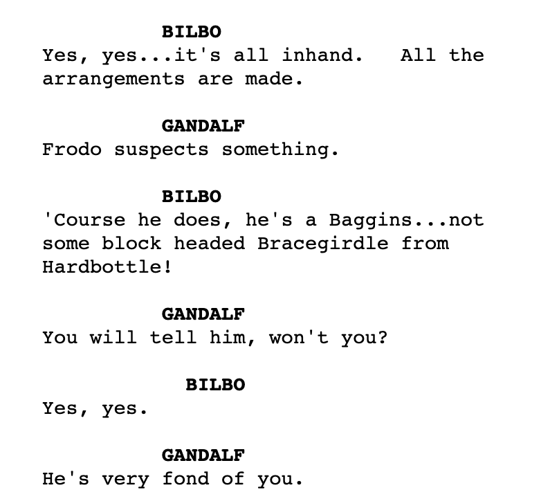
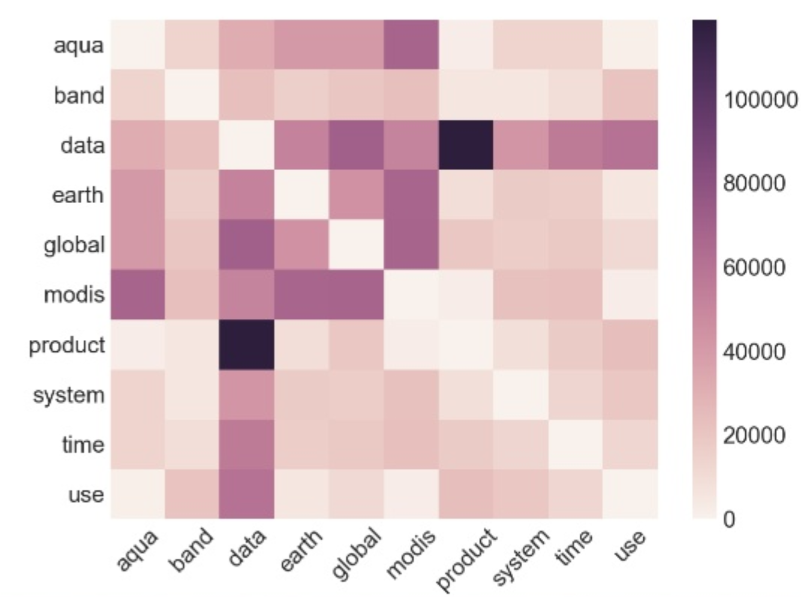

Мысли о предположенных и предполагаемых, потенциально возможных вдохновлениях и интуициях идей проектов по проге


Есть еще менее проработанная [такая](https://docs.google.com/spreadsheets/d/1S0c-ZEpQuF2zuE3EEMZwnyrYfrBAHNTReo8c8jeELVk/edit?usp=sharing) табличка с идеями


# misc

## парсер сценариев и субтитров
кажется, в интернете есть много сценариев и субтитров. сценарии пишутся примерно в одном формате.



если бы можно было научиться парсить их в единообразные csv с разметкой кто что сказал, было бы круто, можно потом это по-разному поисследовать и поделать всякий DH типа такого ([1](https://pudding.cool/2017/08/screen-direction/), [2](https://pudding.cool/2017/03/film-dialogue/)).

## чат-боты и краулеры это круто но может оказаться сложно *НО ЛИЧНО Я ЗА*


# я зык
**NB.** помимо всяких языков есть всякие другие языки.

## мат. основания методов NLP
### PCA
Реализовать PCA для визуализации bag-of-words (это, например, частотный список) представлений текстов.

Программа должна будет рисовать что-то типа такой картинки для коллекции текстов.


Взято отсюда ([1](https://dragonfly.hypotheses.org/472)) там прикольно.


Чем меньше логики реализовано вами, а не библиотеками, тем круче. Еще круто всякое удивительное.

Project outcome
+ начальное представление о линейной алгебре
+ азы частотного анализа и тематического моделирования
+ представление о том, как рисовать картинки питоном

### эмбеддинги слов
Заимплементить эмбеддинги (см e.g. туть: ([1](https://rusvectores.org/ru/calculator/#))) слов, используя библиотеку numpy. 

Ожидается word2vec на минималках (e.g. без эвристик из статьи Миколова и новее) но можно другие модели.

Project outcome
+ начальное представление о арифметике над матрицами
+ начальное представление о нейросетях
+ понятие о обучении моделей в собсна машинном обучении

### NER своими руками
что такое NER мона посмотреть тут: ([1](https://habr.com/ru/company/abbyy/blog/449514/))


Примеры идей
* парсинг дат и относительных дат для русского или не для русского или для эльфийского (рил много же фанатов общаются и даже переводят на клингон или эльфийскийТолкиена)
* анализ ошибок существующих библиотек для NER и их улучшение
  e.g. Natasha плохо находит людей с фамилией Гусев, но это чинится добавлением в нее списка имен
* написать свою реализацию какой-то части NER (например, только поиск городов в тексте или только поиск имен животных или всякое нужное бизнесу типа датрождений и телефонных номеров) и сравнить его (субъективно и по популярным метрикам) с Natasha

## Морфология

### Анализ размеченных данных
По куче строк типа

```
tur	verilmesi	ver	VERB	Case=Nom|Number[psor]=Sing,Plur|Person[psor]=3|Valency=2|VerbForm=Vnoun|Voice=Pass
tur	verilmesi	veril	VERB	Case=Nom|Number[psor]=Sing,Plur|Person[psor]=3|Valency=1|VerbForm=Vnoun
tur	fırkası	fırka	NOUN	Case=Nom|Number[psor]=Sing,Plur|Person[psor]=3
tur	yanda	yan	NOUN	Case=Loc
tur	aktivist	aktivist	NOUN	Case=Nom
tur	okulda	okul	NOUN	Case=Loc
```
можно что-то посмотреть.

Некоторые идеи

* составить информацию о совместной встречаемости морфологических тегов и отобразить в виде хитмапа по таблице совместной встречаемости



* найти комбинации суффиксов, которые всегда имеют несколько возможных разборов. e.g. *larında* в приведённых выше разборах


* data-driven выделение морфем.
попробовать автоматически находить соответствия подстрок тегам.  
E.g. кажется, что *да* -- это *Case=Loc* в примере выше. Значит, возможно, это что-то типа морфемы, соответствующей локативу.

### морфоанализаторы для малоресурсных языков

(c)делать морфологический парсер для вашего любимого прикольного|малоресурсного языка
+ можно научиться парсить какую-то \*часть\* морфологии или не морфологии или часть части -- в любом случае это полезно (возможно даже полезнее языку, чем вам)
+ можно все делать используя морфологический фреймворк Тимофея Архангельского
+ можно все делать не используя морфологический фреймворк Тимофея Архангельского


# О творчестве
## Свои темы
+ Это очень круто!
+ Но надо пообсуждать с преподами


## Хакатоны
+ Если вы участвуете в хакатонах или чем-то подобном и вырисовывается какой-то прикольный проект, то ето тоже тема

## Контрибьюшн в опенсорс
+ Принятые или пока не принятые но адекватные пулл-реквесты в какой-то опенсорсный проект на питоне. Багфиксы, улучшения -- супер. Рефакторинг только если его много и его приняли.
